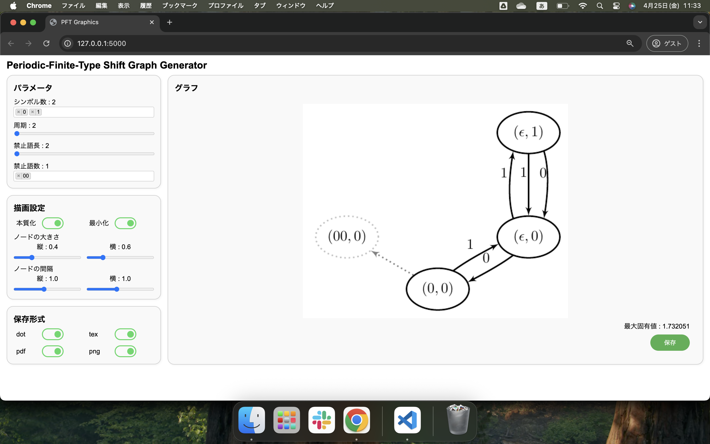

# PFT グラフ生成アプリ

選択したシンボルと禁止語から周期的有限型（PFT）グラフを生成し、グラフ画像を表示・保存できる Flask アプリケーションです。

---

## 🖥️ 実行環境

- Python 3.8 以上
- pip
- TeX Live（`pdflatex` を含む）
- `poppler`（PDF → PNG 変換に必要）

---

## 📦 セットアップ手順

### 1. リポジトリをクローン

```bash
git clone https://github.com/your-username/your-repo.git
cd your-repo
```

### 2. 仮想環境の作成（任意）

```bash
python -m venv venv
source venv/bin/activate   # Windows: venv\Scripts\activate
```

### 3. 依存パッケージのインストール

```bash
pip install -r requirements.txt
```

---

## ⚙️ 外部ツールのインストール

### ◼ TeX（LaTeX）

`pdflatex` を使うために TeX Live 等をインストールしてください。

**Ubuntu:**
```bash
sudo apt install texlive-latex-base
```

**Mac (Homebrew):**
```bash
brew install --cask mactex
```

**Windows:**

- [TeX Live](https://www.tug.org/texlive/) をインストールし、`pdflatex` にパスが通っていることを確認してください。

---

### ◼ Poppler（`pdf2image` に必要）

**Ubuntu:**
```bash
sudo apt install poppler-utils
```

**Mac (Homebrew):**
```bash
brew install poppler
```

**Windows:**

- [poppler for Windows](http://blog.alivate.com.au/poppler-windows/) からダウンロードし、bin フォルダのパスを通してください。

---

## 🚀 アプリの起動

```bash
python app.py
```

起動後、ブラウザで以下にアクセス：

```
http://localhost:5000
```

---

## 📂 ディレクトリ構成

```
your-repo/
├── app.py
├── input_values.json
├── README.md
├── requirements.txt
├── src
│   ├── __init__.py
│   ├── node.py
│   └── periodic_finite_type.py
├── static
│   ├── css
│   │   └── style.css
│   ├── js
│   │   └── script.js
│   └── uploads
└── templates
    └── index.html
```

---

## 📸 デモ

アプリの操作を示すデモ動画です。下のサムネイル画像をクリックすると、Google Drive 上の動画が再生されます。

<p align="center">
  <a href="https://drive.google.com/file/d/13ndHajAB62s-EdyCwBWWqwqzT4KsHJ6U/view?usp=drive_link" target="_blank">
    
  </a>
</p>